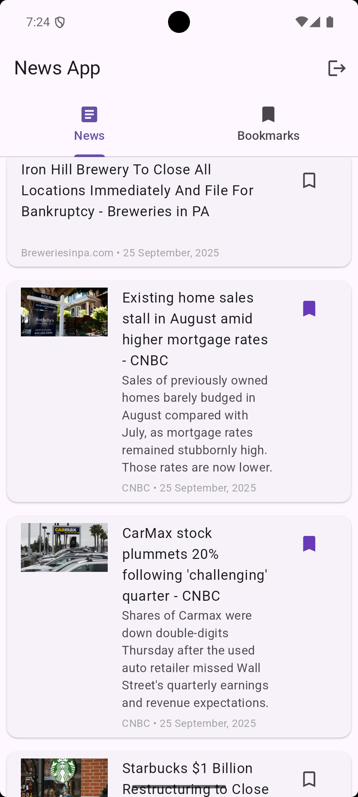
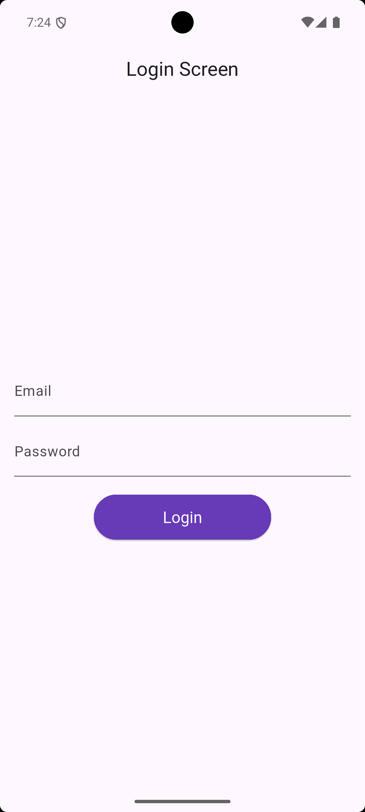
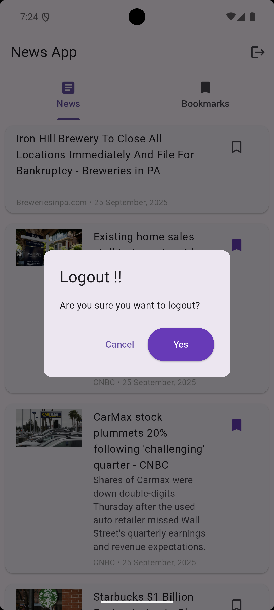
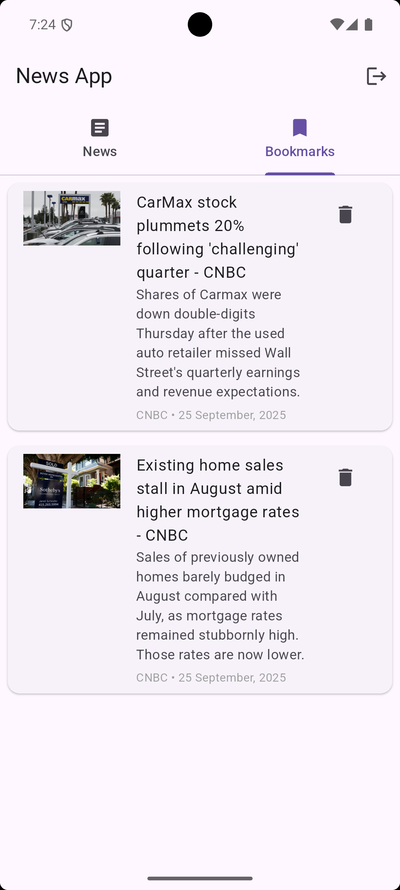

# news_app_aibuzz

# Setup Instructions
1. Clone the repo: git clone <https://github.com/anaszia432/news_app_aibuzz.git>
2. Navigate to project: cd news_app_aibuzz
3. Install dependencies: flutter pub get
4. Run the app: flutter run

# Screenshots of the app
Home Screen:  
- 

Login Screen:  
- 

Logout Dialog Screen:  
- 

Webview Screen:  
- 

Bookmark Screen:  
- 

# Brief explanation of architecture choices
I used GetX for state management because it simplifies reactive programming.    
Folder structure:
- lib/ : contains GetX controllers
- lib/ : contains UI screens
- models/ : data models

# List of third-party packages used and why
- get: For state management and routing
- dio: For API calls
- shared_preferences: To store local data
- webview_flutter: To show the selected news in web view, used to display web pages within Flutter app
- intl: for date and time formatting, also used for message and number formatting

# Google Drive link for .apk file
- Link: https://drive.google.com/file/d/14k_FSm_BhjwPbZdzgMfCQ3-R4239BqF9/view?usp=sharing
